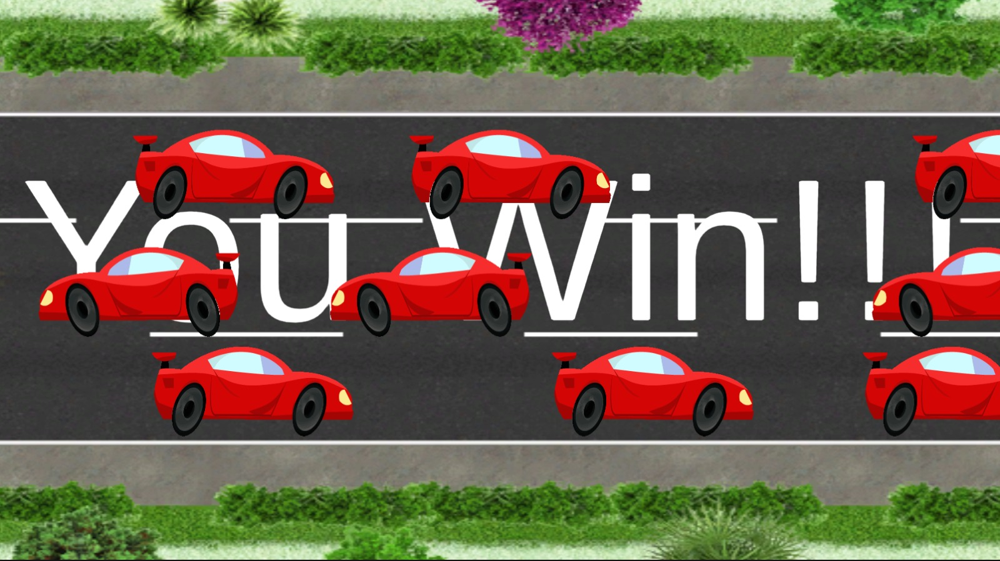

# Ex2-Models-And-Triggers

## This project will practically show Unity models and triggers by implementing several little games.

### Changing and Improving the game 
---

In the first game the user plays as a spaceship so he has to fire a laser at the enemies that are constantly being spawned on the  screen.

The user must evade the enemies with the arrow keys and destroy them with laser shots (with the space button).

In addition, at any given time - an object representing a "shield" appears, and when the user touches it - it will be immune from enemy hits for exactly 5 seconds
and on its spaceship icon will appear a yellow shield that will become more and more transparent as the 5 seconds end.

Moreover, at the top right of the screen will be his life points (3 hearts) - so that if the user is hit by enemies 3 times, he will lose the game and disappear from the screen.

##### Here are some screenshots from the game described:

##### Here are some references to the code:

A script for equip the spaceship with a shield and make a reflection for the shield:

<https://github.com/Ron-Yogev/Ex2-Models-And-Triggers/blob/master/02-prefabs-triggers/Assets/Scripts/3-collisions/ShieldThePlayer.cs>

A script that describes the number of life points a player has:

<https://github.com/Ron-Yogev/Ex2-Models-And-Triggers/blob/master/02-prefabs-triggers/Assets/Scripts/4-levels/LifesLost.cs>

### Boundaries Implementation
---

In the second game we dealt with types of boundaries:

##### 1. A flat world with visible boundaries that cannot be crossed

##### Here are some screenshots from the game described:

##### Here are some references to the code:

A script that takes the height and weight of the camera and object and restricts the player from going out of the world:

<https://github.com/Ron-Yogev/Ex2-Models-And-Triggers/blob/master/02-prefabs-triggers/Assets/Scripts/3-collisions/boundaries.cs>

___

##### 2. A flat world with invisible boundaries.

When enemies pass the bottom of the screen, they are destroyed, and when the laser passes the top of the screen it is destroyed.

##### There is no code in this section, we just added Edge Collider 2D Component.
___

##### 3. Round World - When the player reaches one side of the world, he appears on the other side.

##### Here are some screenshots from the game described:

##### Here are some references to the code:

A script which moves the player horizontally to the other side of the world:

<https://github.com/Ron-Yogev/Ex2-Models-And-Triggers/blob/master/02-prefabs-triggers/Assets/Scripts/1-movers/HorizontalSphere.cs>

A script which moves the player vertically to the other side of the world:

<https://github.com/Ron-Yogev/Ex2-Models-And-Triggers/blob/master/02-prefabs-triggers/Assets/Scripts/1-movers/VerticalSphere.cs>

### Core Processes Implementation
---

In the third game we created a game of a frog that has to cross the road with the help of keyboard arrows without getting hit by cars.

There are 3 lanes so that in each lane cars travel in both directions at random time so the user plays the frog and has to cross to the other side of the road.

##### Here are some screenshots from the game described:

##### Here are some references to the code:

A script that moves the frog continuously to the right and left and in steps by the up and down arrows (jump):

<https://github.com/Ron-Yogev/Ex2-Models-And-Triggers/blob/master/02-prefabs-triggers/Assets/Scripts/1-movers/KeyBoardFrogMover.cs>

A script that spwaning vehicles on both sides of the screen:

<https://github.com/Ron-Yogev/Ex2-Models-And-Triggers/blob/master/02-prefabs-triggers/Assets/Scripts/2-spawners/TimedSpawnerRandom.cs>

A script that shows to the player text "Game Over" if he loses, and shows to the player text "You Win" if he wins the game:

<https://github.com/Ron-Yogev/Ex2-Models-And-Triggers/blob/master/02-prefabs-triggers/Assets/Scripts/4-levels/WinOrLost.cs>

